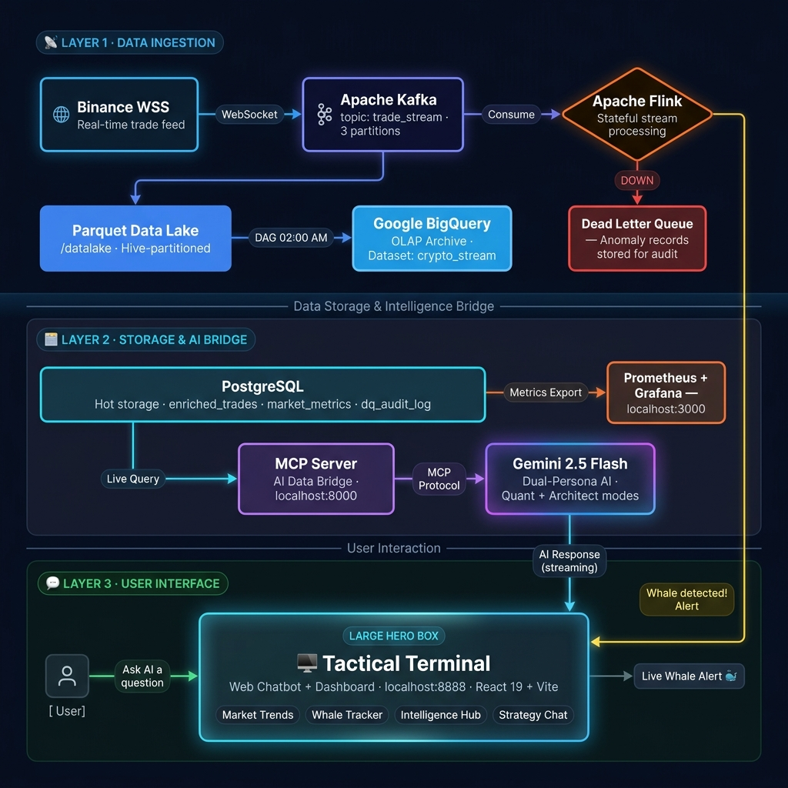

# 🛸 CryptoStream AI: Institutional Tactical Terminal

**CryptoStream AI** is a bank-grade real-time market intelligence system. It combines high-throughput data engineering (Kafka/Flink) with advanced LLM reasoning (Gemini 2.5 Flash) to provide actionable trading insights for the Virtual Banking sector.

---

## 🏛️ Project Vision
Designed for high-availability analytics, this platform demonstrates the "Tactical Terminal" design philosophy—prioritizing data density, readability, and sub-second intelligence delivery while maintaining full regulatory audit trails for the Thailand Virtual Banking landscape.

## 🚀 Key Technologies
- **Intelligence:** Google Gemini 2.5 Flash via Model Context Protocol (MCP)
- **Data Streaming:** Apache Kafka (7+ partitions)
- **Real-time Compute:** Apache Flink (Stateful Window Processing)
- **Analytics Bridge:** FastAPI + Python 3.10+
- **Interactive UI:** React 19 + Vite (Tailwind CSS v4)
- **Archive Layer:** Google BigQuery (Analytical Data Warehouse)
- **Infrastructure:** Docker Compose, Prometheus, Grafana

---

## 🌊 Data Flow — จากตลาดโลกสู่หน้าจอคุณ

ทุกครั้งที่มีการซื้อขาย BTC บน Binance ข้อมูลนั้นจะเดินทางผ่านระบบของเราภายในเวลาไม่ถึง **1 วินาที** ก่อนที่คุณจะได้เห็นมันบนหน้าจอ Tactical Terminal — นี่คือเส้นทางทั้งหมดครับ:

> 💡 **อ่านแผนผังให้เข้าใจ:** ข้อมูลไหล **จากซ้ายไปขวา** — เริ่มจาก Binance ไปสิ้นสุดที่หน้าจอของคุณ ทุก Trade จะถูก Flink ตรวจสอบคุณภาพ หากเป็น "วาฬ" (> 0.5 BTC) จะส่ง Alert ทันที หากข้อมูลผิดปกติจะถูกเก็บใน DLQ ข้อมูลที่ดีจะไหลเข้า PostgreSQL → AI → หน้าจอคุณ และจะถูก Archive ขึ้น BigQuery ทุกคืน 02:00 AM อัตโนมัติครับ

---

## ⚡ Quick Start (The "จัดเลย" Sequence)

To launch the entire institutional stack, follow the **Boot Sequence** in our [USER_GUIDE.md](./USER_GUIDE.md):

1. **Infrastructure:** `docker compose up -d`
2. **AI Bridge:** `python -m uvicorn mcp_server.main:app --port 8000`
3. **Analytics Server:** `python chat_server.py`
4. **Terminal UI:** `cd frontend && npm run dev`

---

## 💎 Institutional Highlights
- **Real-time Whale Detection:** Flink-powered tracking of large-scale BTC movements (> 0.5 BTC).
- **Dual-Persona Reasoning:** Seamless switching between *Quant Strategist* and *Technical Architect*.
- **Data Quality Governance:** Automated rejected-record logging (DLQ) for regulatory audit.
- **Micro-Batch Data Lake:** High-efficiency Parquet compression for multi-year retention.

## 📂 Project Structure
- `/mcp_server`: The core bridge connecting AI to the PostgreSQL Lakehouse.
- `/frontend`: The high-end Tactical Terminal React application.
- `/streaming`: Flink processors and Kafka producers/consumers.
- `/airflow`: Automated DAGs for EOD reporting and BigQuery archival.
- `/monitoring`: Prometheus/Grafana stacks for sub-second system observability.
- `/scripts` & `/tests`: Maintenance and E2E verification suites.
- `/datalake`: Parquet-based cold storage for historical regulatory audit.
- **Archive Layer (BigQuery):** Global analytics layer for long-term retention.

---

## 🔗 Critical Endpoints
- **Main Terminal:** [http://localhost:8888](http://localhost:8888)
- **Intelligence API:** [http://localhost:8000](http://localhost:8000)
- **System Metrics:** [http://localhost:3000](http://localhost:3000)

---

> [!IMPORTANT]
> **Regulatory Notice:** All market data handled by this system is intended for institutional analytics. Real-time data quality logs are preserved in `postgres.dq_audit_log` for regulatory reporting compliance.
