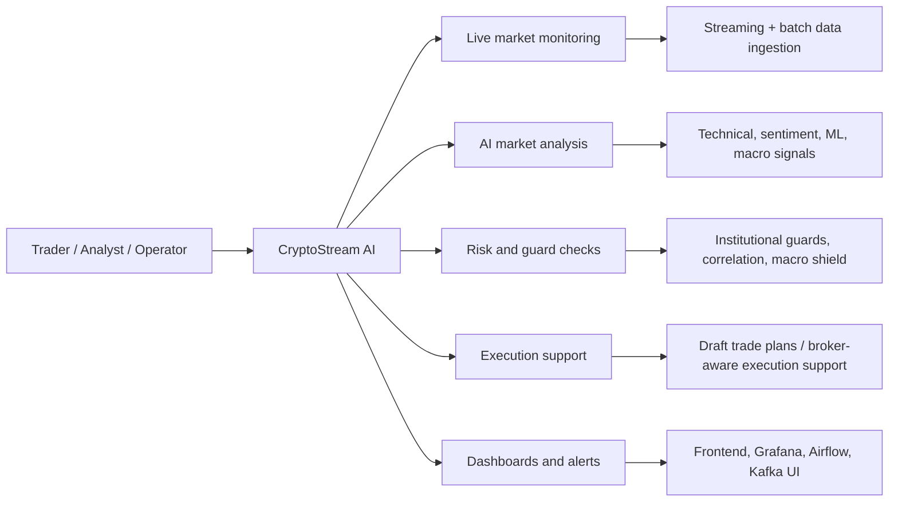
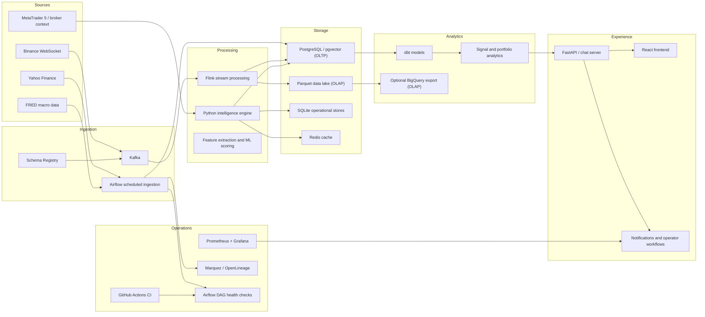
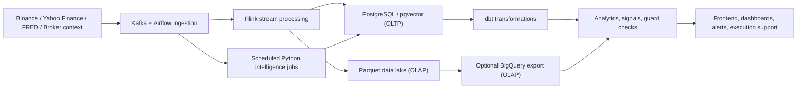
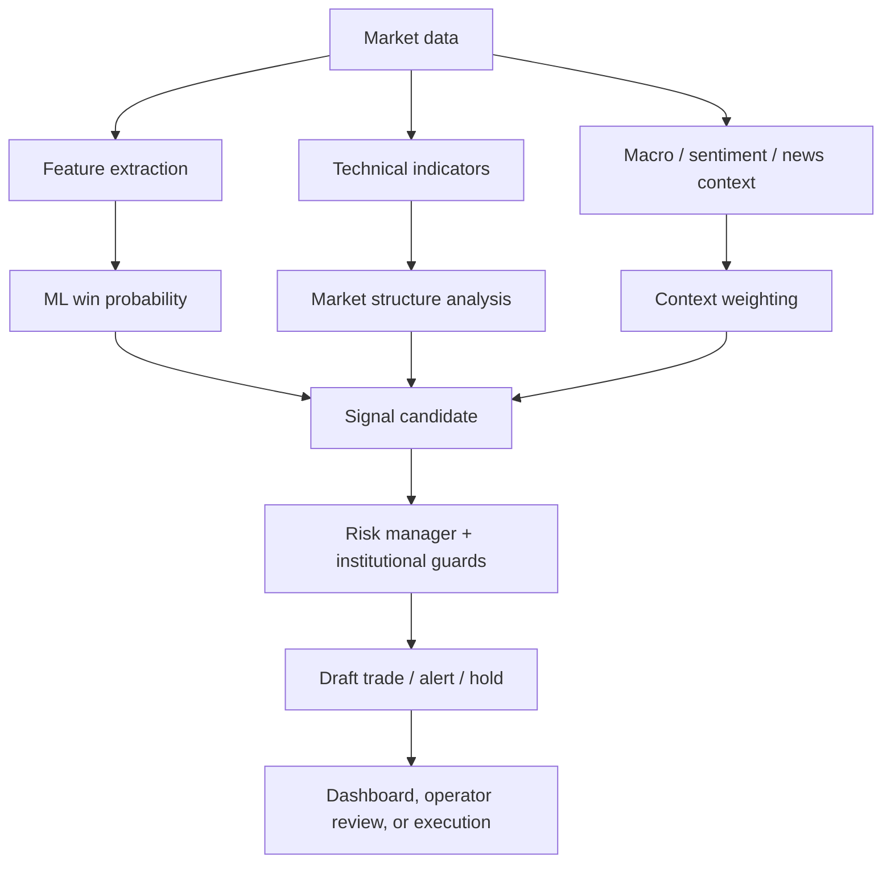

# CryptoStream AI


An end-to-end market intelligence platform that combines real-time data engineering, AI-driven analysis, portfolio risk controls, and operational monitoring in one production-style stack.

It is designed to answer a simple question:

**How do you turn noisy live market data into structured signals, safety checks, dashboards, and automated workflows that are reliable enough to operate continuously?**

---

## At a Glance

CryptoStream AI is a portfolio project that demonstrates how modern data, AI, and platform engineering fit together in one system:

- Ingests market data from streaming and batch sources
- Processes and stores data across OLTP and OLAP layers
- Orchestrates pipelines with Airflow
- Transforms analytical data with dbt
- Generates AI-assisted market analysis and trading context
- Applies risk and guard-rail logic before execution
- Monitors health, lineage, and quality through CI and observability tooling

This makes the project useful for multiple audiences:

- **HR / recruiters**: shows full-stack ownership across backend, data, AI, and operations
- **Engineers**: shows architecture, workflow orchestration, CI discipline, and system boundaries
- **Data teams**: shows ingestion, transformation, quality controls, and warehouse-ready outputs

---

## Why This Project Is Interesting

Most portfolio projects stop at one layer:

- only a dashboard
- only a model
- only a data pipeline
- only a chatbot

CryptoStream AI connects all of them:

1. Live and scheduled market data enters the platform
2. Pipelines clean, enrich, and store that data
3. Analytical features and signals are generated
4. AI and rule-based guard rails interpret the context
5. Results are surfaced to dashboards, operators, and execution paths
6. CI and observability keep the platform stable

That makes it much closer to a real production system than a standalone demo.

---

## Product Overview


```mermaid
flowchart LR
    U["Trader / Analyst / Operator"] --> A["CryptoStream AI"]
    A --> B["Live market monitoring"]
    A --> C["AI market analysis"]
    A --> D["Risk and guard checks"]
    A --> E["Execution support"]
    A --> F["Dashboards and alerts"]

    B --> G["Streaming + batch data ingestion"]
    C --> H["Technical, sentiment, ML, macro signals"]
    D --> I["Institutional guards, correlation, macro shield"]
    E --> J["Draft trade plans / broker-aware execution support"]
    F --> K["Frontend, Grafana, Airflow, Kafka UI"]
```

---

## System Architecture


```mermaid
flowchart LR
    subgraph Sources
        A1["Binance WebSocket"]
        A2["Yahoo Finance"]
        A3["FRED macro data"]
        A4["MetaTrader 5 / broker context"]
    end

    subgraph Ingestion
        B1["Kafka"]
        B2["Schema Registry"]
        B3["Airflow scheduled ingestion"]
    end

    subgraph Processing
        C1["Flink stream processing"]
        C2["Python intelligence engine"]
        C3["Feature extraction and ML scoring"]
    end

    subgraph Storage
        D1["PostgreSQL / pgvector (OLTP)"]
        D2["Parquet data lake (OLAP)"]
        D3["SQLite operational stores"]
        D4["Redis cache"]
    end

    subgraph Analytics
        E1["dbt models"]
        E2["Optional BigQuery export (OLAP)"]
        E3["Signal and portfolio analytics"]
    end

    subgraph Experience
        F1["React frontend"]
        F2["FastAPI / chat server"]
        F3["Notifications and operator workflows"]
    end

    subgraph Operations
        G1["GitHub Actions CI"]
        G2["Prometheus + Grafana"]
        G3["Marquez / OpenLineage"]
        G4["Airflow DAG health checks"]
    end

    A1 --> B1
    A2 --> B3
    A3 --> B3
    A4 --> C2
    B2 --> B1
    B1 --> C1
    B3 --> D1
    C1 --> D1
    C1 --> D2
    C2 --> D1
    C2 --> D3
    C2 --> D4
    D1 --> E1
    D2 --> E2
    E1 --> E3
    E3 --> F2
    F2 --> F1
    F2 --> F3
    B3 --> G4
    B3 --> G3
    G1 --> G4
    G2 --> F3
```

---

## Data Flow


```mermaid
flowchart LR
    A["Binance / Yahoo Finance / FRED / Broker context"] --> B["Kafka + Airflow ingestion"]
    B --> C["Flink stream processing"]
    B --> D["Scheduled Python intelligence jobs"]
    C --> E["PostgreSQL / pgvector (OLTP)"]
    C --> F["Parquet data lake (OLAP)"]
    D --> E
    E --> G["dbt transformations"]
    F --> H["Optional BigQuery export (OLAP)"]
    G --> I["Analytics, signals, guard checks"]
    H --> I
    I --> J["Frontend, dashboards, alerts, execution support"]
```

---

## AI Decision Pipeline


```mermaid
flowchart TD
    A["Market data"] --> B["Technical indicators"]
    A --> C["Macro / sentiment / news context"]
    A --> D["Feature extraction"]
    D --> E["ML win probability"]
    B --> F["Market structure analysis"]
    C --> G["Context weighting"]
    E --> H["Signal candidate"]
    F --> H
    G --> H
    H --> I["Risk manager + institutional guards"]
    I --> J["Draft trade / alert / hold"]
    J --> K["Dashboard, operator review, or execution"]
```

---

## Core Capabilities

- **Real-time ingestion** from Binance and other market sources
- **Batch macro ingestion** for equities, indices, commodities, and economic indicators
- **Airflow-managed orchestration** for ingestion, aggregation, quality checks, retention, and optional warehouse export
- **Streaming analytics** with Kafka and Flink
- **Hybrid storage** using PostgreSQL, Parquet, SQLite, and Redis
- **Analytical transformation** with dbt staging and marts
- **AI-assisted intelligence layer** for technical, sentiment, macro, and ML-driven analysis with live-data fallbacks where upstream sources are unavailable
- **Risk-aware execution workflow** with trade drafting, advisory guard rails, and broker normalization
- **Operational visibility** through Prometheus, Grafana, Marquez, and CI checks

---

## What It Demonstrates

This repository highlights experience across:

- **Data engineering**: Kafka, Flink, Airflow, dbt, and warehouse-ready export paths
- **Backend engineering**: Python services, orchestration logic, persistence layers
- **AI application engineering**: multi-signal analysis, agent-style workflows, ML feature pipelines
- **Reliability engineering**: CI, DAG parsing checks, quality gates, dependency hardening
- **Platform thinking**: local full-stack orchestration with Docker Compose and multiple service boundaries

---

## Tech Stack

| Layer | Technology | Purpose |
|---|---|---|
| Frontend | React + Vite | Tactical UI and operator workflow surface |
| API / App | Python + FastAPI-style backend patterns | AI gateway, orchestration, execution bridge |
| Streaming | Kafka, Schema Registry, Flink | Real-time ingest, stream processing, DLQ patterns |
| Orchestration | Airflow 2.8 | Scheduled pipelines, DAG-based operations |
| Transformation | dbt-postgres | Staging and analytical marts |
| Storage | PostgreSQL, Parquet, SQLite, Redis | OLTP serving, OLAP storage/export, operational state, cache |
| AI / Analytics | Custom intelligence modules, ML signal model | Multi-factor analysis and decision support |
| Observability | Prometheus, Grafana, Marquez | Metrics, dashboards, lineage |
| Quality | Ruff, GitHub Actions, DAG import tests | CI stability and code quality |

---

## Data Sources

| Source | Mode | Example assets |
|---|---|---|
| Binance WebSocket | Real-time | BTC/USDT and crypto trade flow |
| Yahoo Finance | Scheduled | NASDAQ, S&P 500, Gold, Oil, BTC, ETH, SOL |
| FRED | Scheduled | Fed Funds Rate, CPI, yield curve, unemployment, M2 |
| MetaTrader 5 | Runtime broker context | Symbol normalization, execution-aware logic |

---

## Airflow Pipeline Coverage

| DAG | Role |
|---|---|
| `yfinance_macro_ingestion` | Ingests macro and market series on a schedule |
| `yfinance_stocks_ingestion` | Loads a larger equity universe |
| `fred_ingestion` | Pulls macroeconomic indicators |
| `daily_aggregation` | Builds daily rollups and summaries |
| `data_quality` | Runs SQL assertions and blocks bad downstream data |
| `datalake_to_bigquery` | Ships Parquet data into BigQuery |
| `data_retention` | Enforces data lifecycle and cleanup policies |

---

## CI and Quality Gates

Every push and PR to `main` runs automated checks such as:

- Ruff linting
- Airflow DAG import validation
- dbt parsing
- Avro schema validation

This is important because the project is intentionally multi-layered. CI helps catch:

- broken import paths
- missing runtime dependencies
- import-time side effects in Airflow DAGs
- lint regressions that make the codebase harder to maintain

---

## Quick Start

```bash
docker compose up -d
docker compose ps
```

Main local endpoints:

- `http://localhost` - Frontend
- `http://localhost:8888` - Backend / chat server
- `http://localhost:8080` - Kafka UI
- `http://localhost:8081` - Flink UI
- `http://localhost:8082` - Airflow
- `http://localhost:3000` - Grafana
- `http://localhost:3001` - Marquez
- `http://localhost:9090` - Prometheus

---

## Project Structure

```text
.
|-- .github/workflows/ci.yml      # CI quality gates
|-- airflow/dags/                 # Airflow orchestration layer
|-- dbt/                          # Analytical transform layer
|-- frontend/                     # React UI
|-- intelligence/                 # AI, ML, guards, technical analysis, risk logic
|-- services/                     # Supporting runtime services
|-- streaming/                    # Producer, Flink-related processing, lake writer
|-- schemas/                      # Avro contracts
|-- monitoring/                   # Prometheus and Grafana assets
|-- docker-compose.yml            # Full local stack
`-- README.md
```

---

## Why It Reads Well on GitHub

If someone lands on this repository without context, they should be able to understand three things quickly:

1. **What the system does**
2. **Why it is technically interesting**
3. **What kind of engineering work it proves**

That is why this README emphasizes:

- a short product pitch
- visual diagrams
- system boundaries
- business and technical value
- operational maturity through CI and observability

---

## Suggested Next Improvements

If this repository is being used as a portfolio centerpiece, the next high-impact additions would be:

- screenshots or short GIFs of the frontend and dashboards
- a short demo video link
- sample outputs from the AI analysis layer
- a "Lessons learned" section describing design tradeoffs
- deployment notes for cloud or Kubernetes environments

---

## Summary

CryptoStream AI is not just a trading bot and not just a data pipeline.

It is a systems project that brings together:

- real-time data infrastructure
- AI-assisted analysis
- workflow orchestration
- analytical modeling
- execution safety checks
- monitoring and CI discipline

That combination is what makes it useful both as a technical portfolio artifact and as a serious engineering case study.
