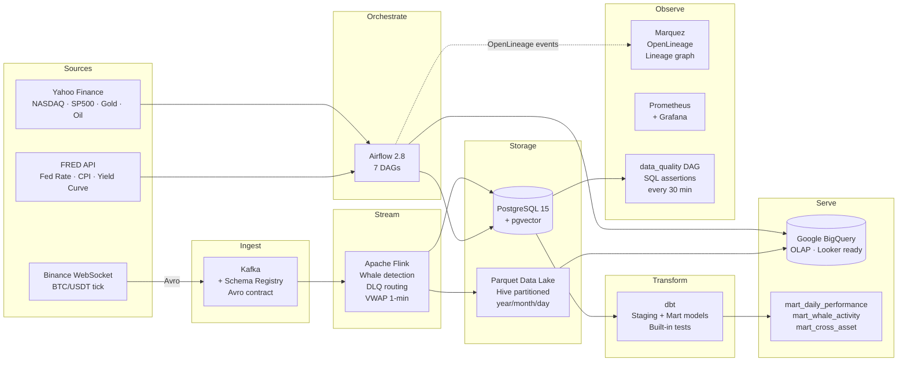

# CryptoStream AI — End-to-End Data Engineering Platform


A production-grade data engineering platform built on a real-time cryptocurrency trading stream.  
Demonstrates the full modern DE stack: **ingest → stream → store → transform → quality → lineage → CI/CD**.

> One command to start 15 services: `docker compose up -d`

---

## Architecture


```mermaid
flowchart LR
    subgraph Sources
        A1[Binance WebSocket\nBTC/USDT tick]
        A2[Yahoo Finance\nNASDAQ · SP500 · Gold · Oil]
        A3[FRED API\nFed Rate · CPI · Yield Curve]
    end

    subgraph Ingest
        B[Kafka\n+ Schema Registry\nAvro contract]
    end

    subgraph Stream
        C[Apache Flink\nWhale detection\nDLQ routing\nVWAP 1-min]
    end

    subgraph Storage
        D[(PostgreSQL 15\n+ pgvector)]
        E[Parquet Data Lake\nHive partitioned\nyear/month/day]
    end

    subgraph Orchestrate
        F[Airflow 2.8\n7 DAGs]
    end

    subgraph Transform
        G[dbt\nStaging + Mart models\nBuilt-in tests]
    end

    subgraph Serve
        H[(Google BigQuery\nOLAP · Looker ready)]
        I[mart_daily_performance\nmart_whale_activity\nmart_cross_asset]
    end

    subgraph Observe
        J[Marquez\nOpenLineage\nLineage graph]
        K[Prometheus\n+ Grafana]
        L[data_quality DAG\nSQL assertions\nevery 30 min]
    end

    A1 -->|Avro| B
    A2 --> F
    A3 --> F
    B --> C
    C --> D
    C --> E
    F --> D
    D --> G
    G --> I
    F --> H
    E --> H
    D --> L
    F -.->|OpenLineage events| J
```

---

## Stack

| Layer | Technology | Details |
|---|---|---|
| **Message Broker** | Apache Kafka 7.4 | 3-partition `trade_stream` + `trade_stream_dlq` |
| **Schema Registry** | Confluent Schema Registry | Avro contract for `TradeEvent` — blocks breaking changes |
| **Stream Processing** | Apache Flink 1.18 | Whale detection (qty > 0.5 BTC), VWAP 1-min tumbling window, DLQ |
| **Hot Storage** | PostgreSQL 15 + pgvector | Enriched trades, OHLCV, feature store, vector embeddings |
| **Cold Storage** | Parquet (Hive partitioned) | Micro-batch flush every 5 min, 7-yr retention |
| **Orchestration** | Apache Airflow 2.8 | 7 DAGs, LocalExecutor, retries + SLA |
| **Transform** | dbt-postgres | 5 staging + 3 mart models, `unique` / `not_null` / `accepted_values` tests |
| **Data Warehouse** | Google BigQuery | Daily Parquet → GCS → BQ load via Airflow |
| **Data Quality** | SQL assertions (custom) | 8 checks, CRITICAL severity blocks pipeline, results in `data_quality_log` |
| **Lineage** | Marquez (OpenLineage) | Auto-emitted by Airflow, dataset dependency graph UI at `:3001` |
| **Monitoring** | Prometheus + Grafana + Alertmanager | Kafka lag, Postgres stats, Flink metrics |
| **CI/CD** | GitHub Actions | Ruff lint → DAG import test → dbt parse → Avro schema validation |

---

## Data Sources

| Source | Frequency | Assets |
|---|---|---|
| **Binance WebSocket** | Real-time tick (~10 ms) | BTC/USDT trade stream |
| **Yahoo Finance** | 15 min (macro) / Daily (equities) | NASDAQ 100, S&P 500, Gold (`GC=F`), Oil (`CL=F`), VIX, ETH, SOL |
| **FRED (Federal Reserve)** | Daily | Fed Funds Rate (`DFF`), Yield Curve (`T10Y2Y`), CPI (`CPIAUCSL`), Unemployment (`UNRATE`), M2 (`M2SL`) |

---

## Airflow DAGs

| DAG | Schedule | Purpose |
|---|---|---|
| `yfinance_macro_ingestion` | `*/15 * * * *` | Macro OHLCV: Gold, Oil, Indices, BTC/ETH/SOL |
| `yfinance_stocks_ingestion` | `30 22 * * 1-5` | 600+ NASDAQ + S&P 500 equities |
| `fred_ingestion` | `0 21 * * *` | FRED macro series → `macro_indicators` table |
| `daily_aggregation` | `0 1 * * *` | EOD OHLCV + whale summary → `daily_summary` |
| `data_quality` | `*/30 * * * *` | 8 SQL assertions — CRITICAL failure blocks downstream |
| `datalake_to_bigquery` | `0 2 * * *` | Parquet → GCS → BigQuery load |
| `data_retention` | `0 3 * * *` | Rolling purge: 30d trades, 90d metrics, forever daily |

---

## dbt Transform Layer

Staging models clean and rename source tables. Mart models join across sources for analytics.

```
dbt/models/
├── sources.yml                  ← column-level contracts on all source tables
├── staging/
│   ├── stg_enriched_trades      ← epoch ms → UTC timestamp, is_whale preserved
│   ├── stg_market_ohlcv         ← candle_direction: BULLISH / BEARISH / DOJI
│   ├── stg_daily_summary        ← price_change_pct, whale_volume_pct derived
│   ├── stg_market_features      ← returns 1d–365d, vol, correlation, beta
│   └── stg_macro_indicators     ← FRED: Fed Rate, CPI, Yield Curve, M2
└── marts/
    ├── mart_daily_performance   ← OHLCV + features + market regime per symbol/day
    ├── mart_whale_activity      ← daily buy/sell flow + ACCUMULATING/DISTRIBUTING signal
    └── mart_cross_asset         ← BTC on-chain + Gold + SP500 + Fed Rate + CPI per day
```

**Example query on `mart_cross_asset`:**
```sql
-- Does BTC sell off when the yield curve inverts?
SELECT
    price_date,
    btc_return_pct,
    yield_curve_spread,
    fed_funds_rate
FROM mart_cross_asset
WHERE yield_curve_spread < 0   -- inverted
ORDER BY price_date DESC;
```

**Run dbt:**
```bash
cd dbt
dbt deps                              # install dbt_utils
dbt run --profiles-dir .              # build all models
dbt test --profiles-dir .             # run all schema tests
dbt docs generate && dbt docs serve   # open data catalog at http://localhost:8080
```

---

## Data Quality

The `data_quality` DAG runs 8 SQL assertions every 30 minutes across 3 tables.  
CRITICAL failures raise an `AirflowException` immediately — downstream DAGs do not run on dirty data.

| Check | Table | Severity |
|---|---|---|
| No null price or quantity | `enriched_trades` | CRITICAL |
| All prices > 0 | `enriched_trades` | CRITICAL |
| All quantities > 0 | `enriched_trades` | CRITICAL |
| Whale rate ≤ 5% of trades | `enriched_trades` | WARNING |
| `high >= low` for all candles | `market_ohlcv` | CRITICAL |
| `close` within `[low, high]` | `market_ohlcv` | CRITICAL |
| No negative volumes | `daily_summary` | CRITICAL |
| Price change within ±50% | `daily_summary` | WARNING |

All failures are written to `data_quality_log` for regulatory audit.

---

## Schema Registry (Avro)

The Kafka producer serializes every `TradeEvent` with Avro, validated against `schemas/trade_event.avsc`.

Benefits over plain JSON:
- **Contract enforcement** — Schema Registry rejects incompatible producer changes before they break Flink or the lake-writer
- **Size** — Binary Avro is ~5× smaller than equivalent JSON at this message rate
- **Evolution** — New nullable fields can be added without redeploying consumers

Schema Registry UI is embedded in Kafka UI at `http://localhost:8080`.

---

## Data Lineage (Marquez)

Airflow emits OpenLineage events automatically via the `OPENLINEAGE_URL` environment variable — no DAG code changes required.

Marquez builds the dependency graph showing:
```
Binance WebSocket
  → enriched_trades
      → daily_summary  (daily_aggregation DAG)
          → mart_daily_performance  (dbt)
      → data_quality_log  (data_quality DAG)

yfinance / FRED
  → market_ohlcv / macro_indicators
      → market_features  (feature_store DAG)
          → mart_cross_asset  (dbt)
```

Open lineage UI at `http://localhost:3001`.

---

## Quick Start

```bash
# Start all 15 services
docker compose up -d

# Check everything is healthy
docker compose ps

# Access UIs
http://localhost:8080   Kafka UI + Schema Registry
http://localhost:8081   Flink UI
http://localhost:8082   Airflow       (admin / admin)
http://localhost:3000   Grafana       (admin / cryptostream_admin)
http://localhost:3001   Marquez lineage UI
http://localhost:8085   Schema Registry API
http://localhost:9090   Prometheus
```

---

## CI/CD

Every push and PR to `main` runs 4 jobs in parallel:

```
lint          → ruff E/F/W/I on airflow/dags/, streaming/, intelligence/
dag-tests     → DagBag import test — all 7 DAGs must parse without errors
dbt-parse     → dbt parse validates all SQL model syntax
schema-valid  → fastavro validates all .avsc Avro schemas
```

---

## Project Structure

```
.
├── .github/workflows/ci.yml    ← CI: lint + DAG tests + dbt parse + Avro
├── airflow/dags/               ← 7 Airflow DAGs
├── dbt/                        ← Transform layer (staging + marts + tests)
├── schemas/                    ← Avro schema definitions
├── streaming/                  ← Kafka producer (Avro), Flink, lake-writer
├── infrastructure/             ← schema.sql, init_db.sh, Flink Dockerfile
├── monitoring/                 ← Prometheus rules, Grafana dashboards
├── datalake/                   ← Parquet cold storage (Hive partitioned)
├── k8s/                        ← Kubernetes manifests
├── intelligence/               ← AI agents, technical analysis, signal engine
├── mcp_server/                 ← Model Context Protocol server (AI → SQL)
├── frontend/                   ← React + Vite tactical terminal UI
└── docker-compose.yml          ← Full stack (15 services)
```
